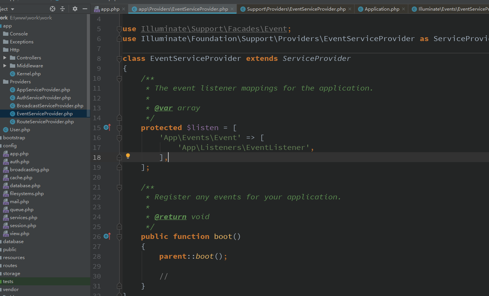
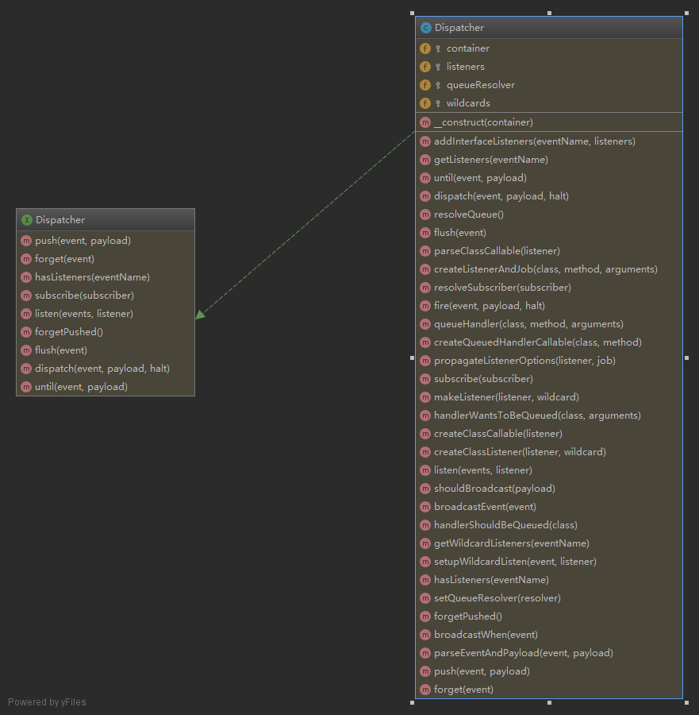
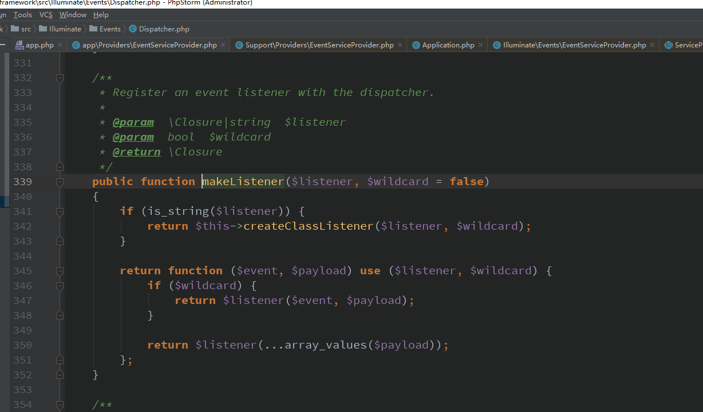

### event
- 事件类注册 
Application注册
  
注册了一个key,value[匿名函数] 

- 事件服务提供类


类结构

  

- 注册事件  
  

事件调度器结构图  
  

往事件里注册事件  


 


```php 
public function createClassListener($listener, $wildcard = false)
    {
        return function ($event, $payload) use ($listener, $wildcard) {
            if ($wildcard) {
                return call_user_func($this->createClassCallable($listener), $event, $payload);
            }

            return call_user_func_array(
                $this->createClassCallable($listener), $payload
            );
        };
    }
```  

当在调用的时候必须传$event,$payload参数  
   
解析监听器  得到监听器类的方法
  

默认得到的是class,method=handle  
当前监听类是否实现了队列【继承】  
   

返回如下结果  
```php  
 protected function createClassCallable($listener)
    {
        list($class, $method) = $this->parseClassCallable($listener);

        if ($this->handlerShouldBeQueued($class)) {
            return $this->createQueuedHandlerCallable($class, $method);
        }

        return [$this->container->make($class), $method];
    }
```  

事件注册完成之后的事件池是  
```php 
$this->listeners[$event][] = function ($event, $payload) use ($listener, $wildcard) {
                                      
                             
                                         return call_user_func_array(
                                             $this->createClassCallable($listener), $payload
                                         );
                                     };
                                     
 $this->createClassCallable($listener)  =[监听类的实例，监听类的方法默认是handle],$payload参数                                    
```  

当监听器是个匿名函数时是这样的  
```php  


$this->listeners[$event][] = function ($event, $payload) use ($listener, $wildcard) {
            if ($wildcard) {
                return $listener($event, $payload);
            }

            return $listener(...array_values($payload));
        };
    }
```   

通配符事件监听器  
```php  
public function listen($events, $listener)
    {
        foreach ((array) $events as $event) {
            if (Str::contains($event, '*')) {
                $this->setupWildcardListen($event, $listener);
            } else {
                $this->listeners[$event][] = $this->makeListener($listener);
            }
        }
    }

    /**
     * Setup a wildcard listener callback.
     *
     * @param  string  $event
     * @param  mixed  $listener
     * @return void
     */
    protected function setupWildcardListen($event, $listener)
    {
        $this->wildcards[$event][] = $this->makeListener($listener, true);
    }
```  

- 事件调度运行   
```php  
if (! function_exists('event')) {
    /**
     * Dispatch an event and call the listeners.
     *
     * @param  string|object  $event
     * @param  mixed  $payload
     * @param  bool  $halt
     * @return array|null
     */
    function event(...$args)
    {
        return app('events')->dispatch(...$args);
    }
}
```