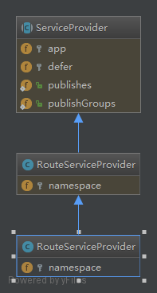
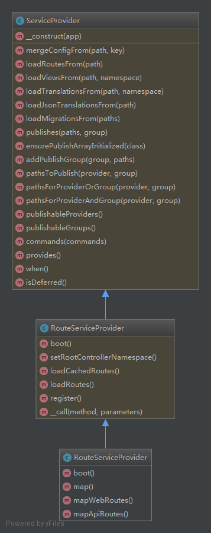

### laravel route 最骚的地方  
- route 是如何运行的？  
```php  
$kernel = $app->make(Illuminate\Contracts\Http\Kernel::class);


public function __construct(Application $app, Router $router)
    {
        $this->app = $app;
        $this->router = $router;

        $router->middlewarePriority = $this->middlewarePriority;
        /**
        向路由类添加路由中间件类
        向路由类添加中间件类组
         **/
        foreach ($this->middlewareGroups as $key => $middleware) {
            $router->middlewareGroup($key, $middleware);
        }

        foreach ($this->routeMiddleware as $key => $middleware) {
            $router->aliasMiddleware($key, $middleware);
        }
    }
    
    
$response = $kernel->handle(
    /**
    该Request类是Symfony的一个组件
    该组件的详细文档在https://symfony.com/doc/current/components/http_foundation.html
    大体功能是对PHP的超级全局变量进行了封装,$_GET,$_POST,$_HEADER,$_SERVER等封装为对象
    并组合成组合对象返回
     **/
    $request = Illuminate\Http\Request::capture()
);

public function handle($request)
    {

        try {
            /**
            Symfony组件的Request组件方法
             **/
            $request->enableHttpMethodParameterOverride();

            $response = $this->sendRequestThroughRouter($request);
        } catch (Exception $e) {
            $this->reportException($e);

            $response = $this->renderException($request, $e);
        } catch (Throwable $e) {
            $this->reportException($e = new FatalThrowableError($e));

            $response = $this->renderException($request, $e);
        }

        $this->app['events']->dispatch(
            new Events\RequestHandled($request, $response)
        );

        return $response;
    }
    
protected function sendRequestThroughRouter($request)
    {
        /**
        将当前的请求对象进行绑定，绑定到Application类的对象下
         **/
        $this->app->instance('request', $request);

        Facade::clearResolvedInstance('request');

        /**
        循环运行本类的成员$this->$bootstrappers[]下的成员数组
         **/
        $this->bootstrap();

        return (new Pipeline($this->app))
                    ->send($request) //加载全局中间件
                    ->through($this->app->shouldSkipMiddleware() ? [] : $this->middleware)
                    ->then($this->dispatchToRouter());

        /**
        $this->dispatchToRouter() 控制器运行之后返回的响应，响应由Symfony的组件完成
         **/
    }
    
    
public function bootstrap()
    {
        if (! $this->app->hasBeenBootstrapped()) {
            $this->app->bootstrapWith($this->bootstrappers());
        }
    }
    
protected function bootstrappers()
    {
        return $this->bootstrappers;
    }
    
protected $bootstrappers = [
        //加载环境变量配置文件.env会全部加载解析并保存在
        //  $_ENV[$name] = $value;
        //  $_SERVER[$name] = $value;
        \Illuminate\Foundation\Bootstrap\LoadEnvironmentVariables::class,
        //加载配置目录下的所有配置文件并保存Applicaton下$this->instance[config]= Repository()对象
        \Illuminate\Foundation\Bootstrap\LoadConfiguration::class,
        //设置错误，异常，关机处理句柄
        \Illuminate\Foundation\Bootstrap\HandleExceptions::class,
        /**
        注册框架所有的门面类【伪装类】，在调用门面类时会自动触发自动加载方法，并转换为别名返回
        门面【伪装类】的配置是app.php下的alias[]数组里的类，包括boostrap/cahce下的文件
        
        伪装类的使用运行过程：
        1、将所有的伪装类注册保存在AliasLoader类下
        2、当使用伪装类调用时会触发自动加载，并会触发伪装基类的魔术方法完成使用Application实例化
        3、如果使用伪装类的别名使用时【路由定义文件使用伪装别名】，也会触发AliasLoader转换为具体的伪装类完成自动加载

         **/
        \Illuminate\Foundation\Bootstrap\RegisterFacades::class,
        /**
        整个框架的服务提供类包运行并实例化，包括composer安装加载的类库包
         **/
        \Illuminate\Foundation\Bootstrap\RegisterProviders::class,
        \Illuminate\Foundation\Bootstrap\BootProviders::class,
    ];


namespace Illuminate\Foundation\Bootstrap;

use Illuminate\Contracts\Foundation\Application;

class RegisterProviders
{
    /**
     * Bootstrap the given application.
     *
     * @param  \Illuminate\Contracts\Foundation\Application  $app
     * @return void
     */
    public function bootstrap(Application $app)
    {
        /**
        注册配置文件里配置的服务提供者类
         **/
        $app->registerConfiguredProviders();
    }
}

public function registerConfiguredProviders()
    {
        /**
        $this->config这样调用会触发本类的魔术方法即拦截器，会自动得到config对象
        config对象的类位于Illuminate\Config 时该config对象支持数组形式访问
        Collection是个集合类，该类的基本功能是对数组进行处理
         **/
        $providers = Collection::make($this->config['app.providers'])
                        ->partition(function ($provider) {

                            //循环处理 检测给的字符串是否含有指定的字符串

                            /**
                            循环$this->config['app.providers']得到app.php配置文件服务提供者类数组
                            判断是否是以指定的字符串开始
                             **/

                            return Str::startsWith($provider, 'Illuminate\\');
                        });

        /**
        $this->make(PackageManifest::class) 在实例化Application的时候已经绑定
        此方法和Http内核的使用方法一样
        PackageManifest框架的类包清单管理类即通过composer工具下载安装的包对其管理
        主要是会根据composer的动作随时更新boostarp/cache/下面的文件
         **/
        $providers->splice(1, 0, [$this->make(PackageManifest::class)->providers()]);

        /**

        加载所有的服务提供者类

        FileSystem 文件系统处理类 它是Symfony组件之一，具体文档在https://symfony.com/doc/current/components/filesystem.html
        用于对文件，目录进行更丰富的管理

         **/
        (new ProviderRepository($this, new Filesystem, $this->getCachedServicesPath()))
                    ->load($providers->collapse()->toArray());
    }
   
   
public function load(array $providers)
    {
        //$providers 是配置文件里配置好的providers服务提供者类数组
        $a = "在这里查看providers和maifestPath的值";
        $this->manifestPath;//cache/service.php配置文件
        /**
        从配置文件里加载服务提供 者类require
         **/
        $manifest = $this->loadManifest();

        // First we will load the service manifest, which contains information on all
        // service providers registered with the application and which services it
        // provides. This is used to know which services are "deferred" loaders.
        if ($this->shouldRecompile($manifest, $providers)) {
            $manifest = $this->compileManifest($providers);
        }

        // Next, we will register events to load the providers for each of the events
        // that it has requested. This allows the service provider to defer itself
        // while still getting automatically loaded when a certain event occurs.
        foreach ($manifest['when'] as $provider => $events) {
            $this->registerLoadEvents($provider, $events);
        }

        // We will go ahead and register all of the eagerly loaded providers with the
        // application so their services can be registered with the application as
        // a provided service. Then we will set the deferred service list on it.
        foreach ($manifest['eager'] as $provider) {
            $this->app->register($provider);
        }

        $this->app->addDeferredServices($manifest['deferred']);
    }
```   

服务提供类哪里来的？  
框架的配置文件app的provider项和第三方扩展包【通过composer require package包安装的扩展】 
会触发composer的指定脚本运行，并读取第三方扩展包的provider写入bootstrap/cache.php  

框架在实例化Http kernel的时候会运行服务提供类的运行服务，同时检测bootstrap/cache/server.php  
是否有数据，然后写入该文件，服务提供类有deferred【是否延迟加载】，when【事件加载】，provides  
该服务提供类可能还会有更多的服务提供类即它提供的provides【比如FromRequestServer】  

如果服务提供类是事件when,即时加载eager的会立马运行，而延迟的则保存在容器里  


- RouteServiceProvider的结构图  


字段结构图  
  

方法结构图  

