### session  
- session 服务提供类  
```php  
protected function registerSessionManager()
    {
        $this->app->singleton('session', function ($app) {
            return new SessionManager($app);
        });
    }
    
$this->app->singleton('session.store', function ($app) {
            // First, we will create the session manager which is responsible for the
            // creation of the various session drivers when they are needed by the
            // application instance, and will resolve them on a lazy load basis.
            return $app->make('session')->driver();
        });
```   
  

- [session使用手册](https://learnku.com/docs/laravel/5.5/session/1301#retrieving-data)  
全局函数的操作  


sessionManager类结构图  

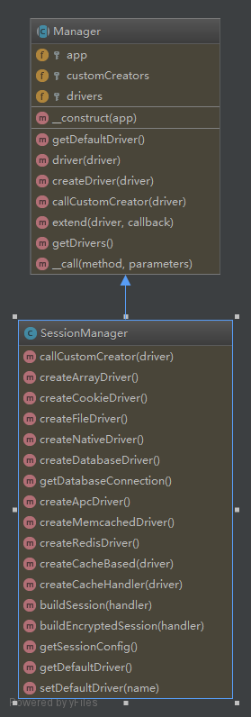    

实例化调用如下方法    
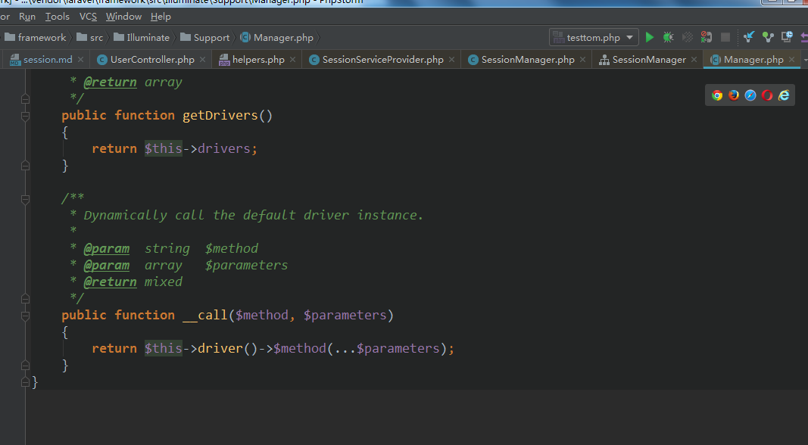  
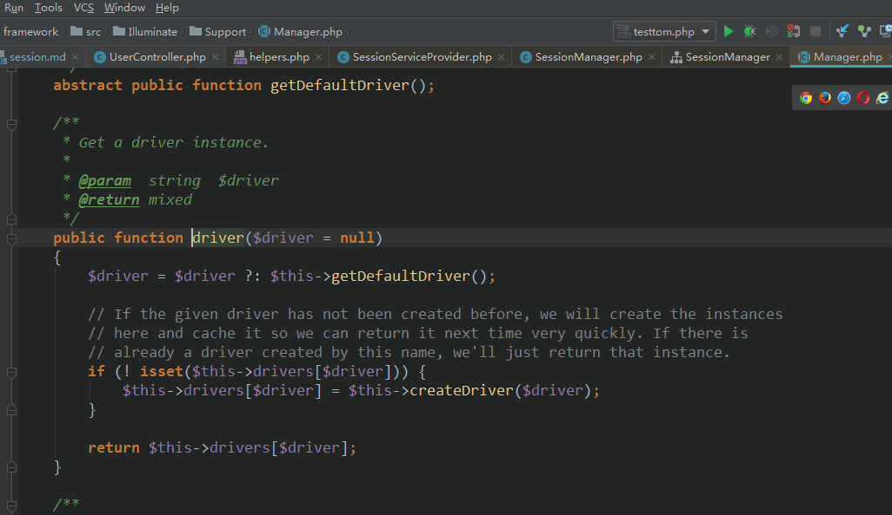  
  
  
  
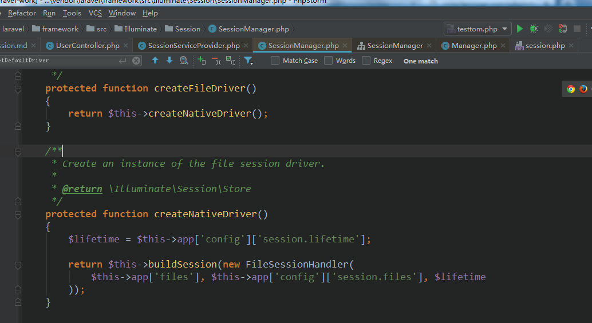  
  
  


Store/session结构图  
    

get获取数据  
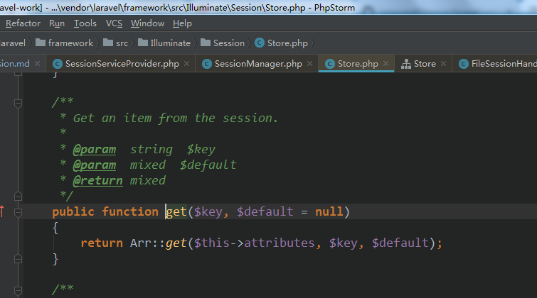    


- startSession中间件   
handle   


是否配置了session  
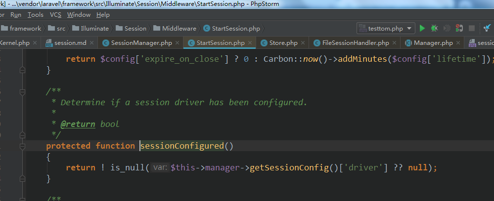    

startSession  
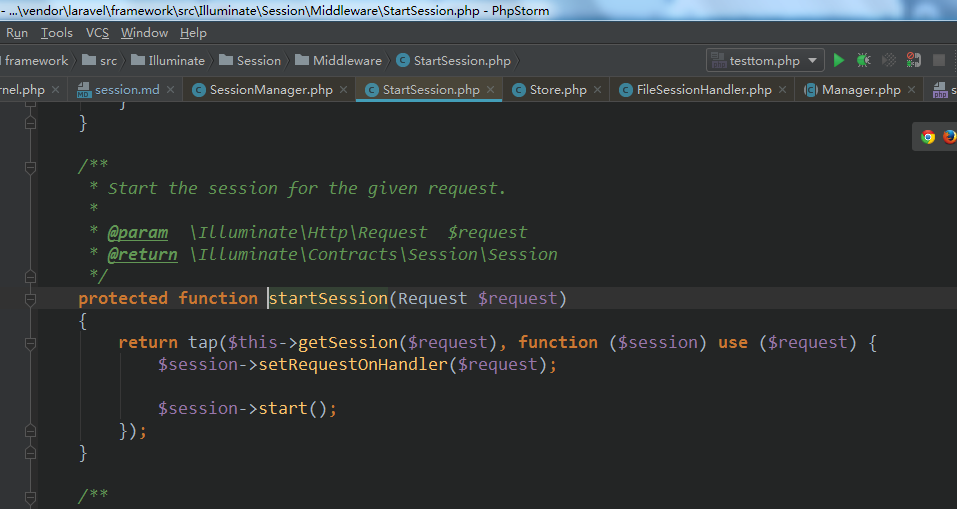    

getSession  
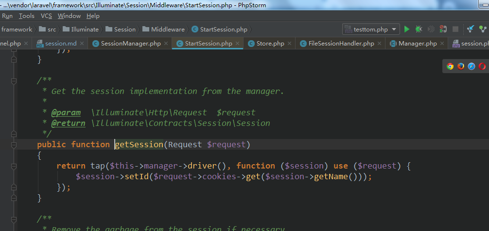 

startSession  
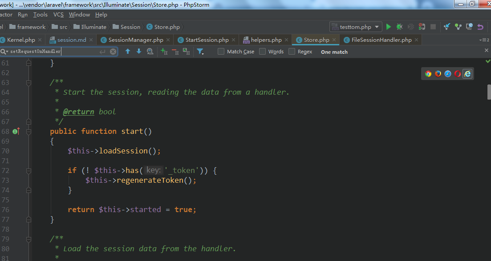   

- startSession流程  
loadAttribute  
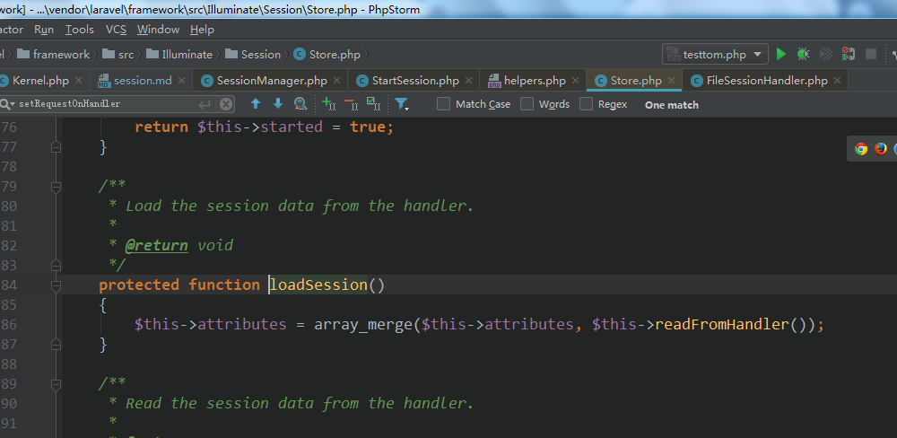  
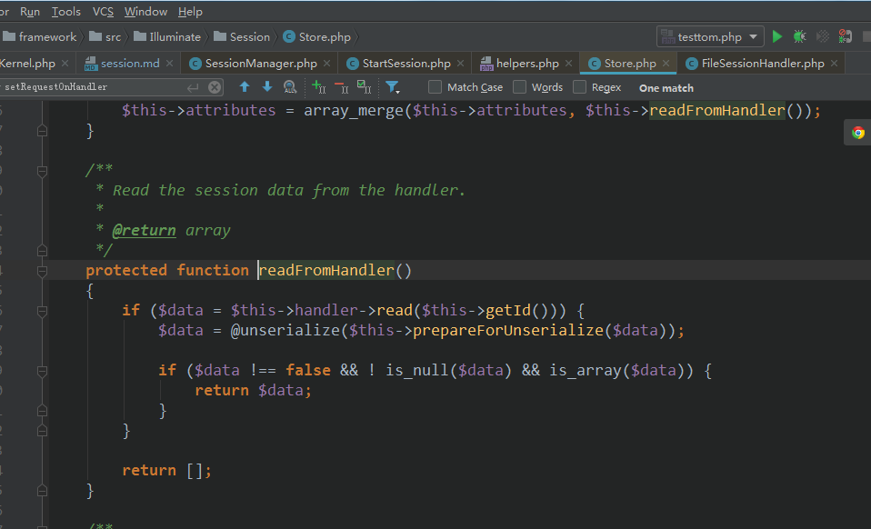  
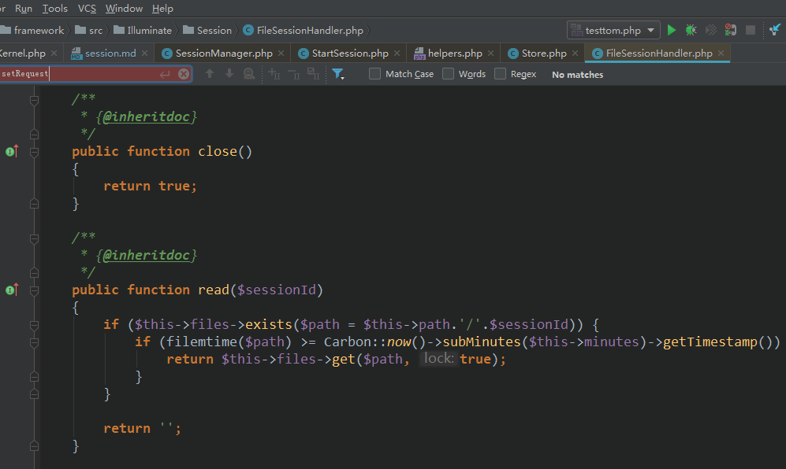   

token   
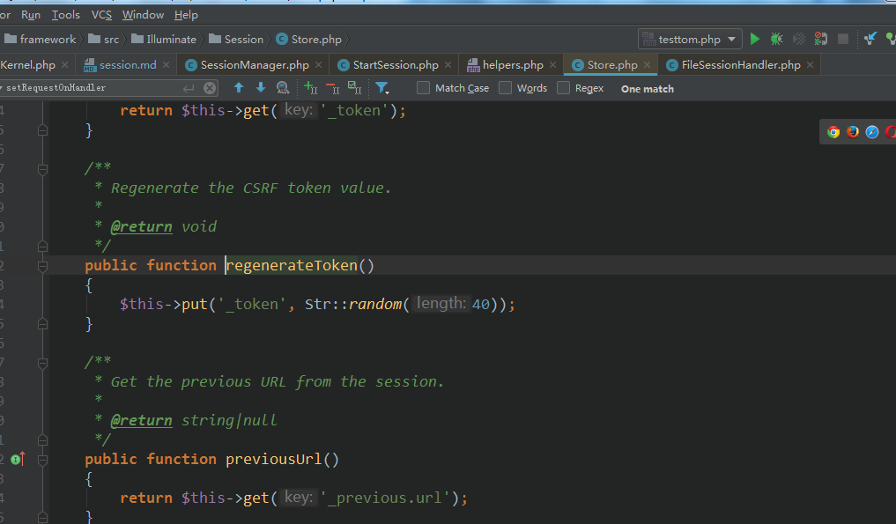 
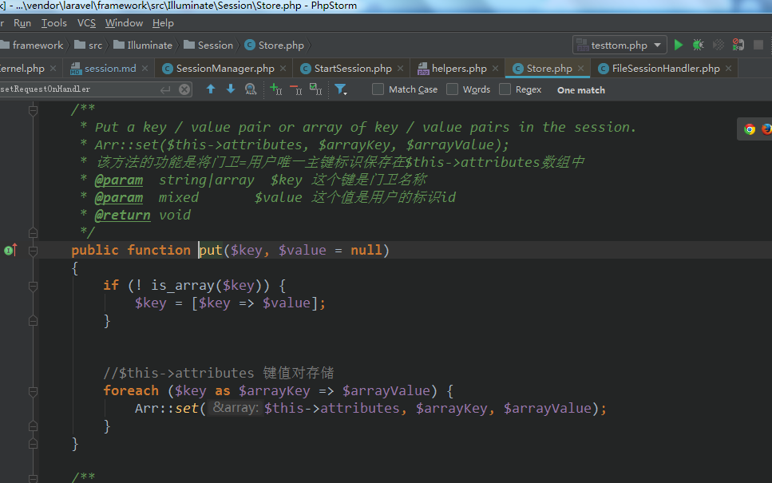   

在http请求时，框架会运行startSession中间件，根据session.php配置实现存储类型  
如file,redis,database等实例化Store【Illuminate\Session\Store】并返回该对象   
【store内置了Illuminate\Session\FileSessionHandler根据配置文件指定】 然后生成  
sessionId,_token，同时将数据保存在Store【attributes成员数组下】    

session/Store   
     


- request 实例设置Session  
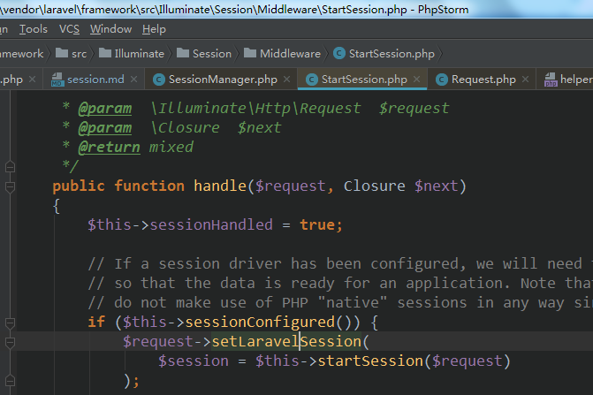  
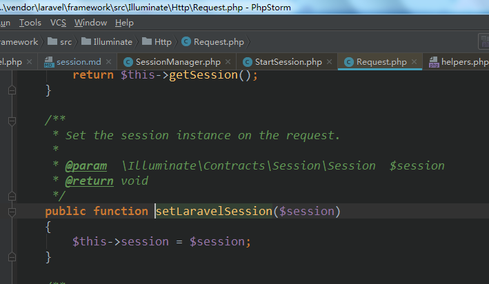    

- session gc 回收  
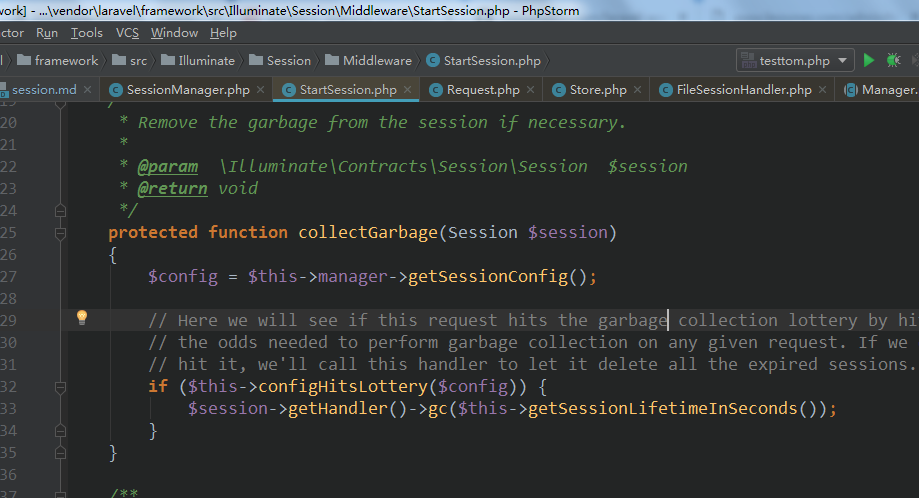 
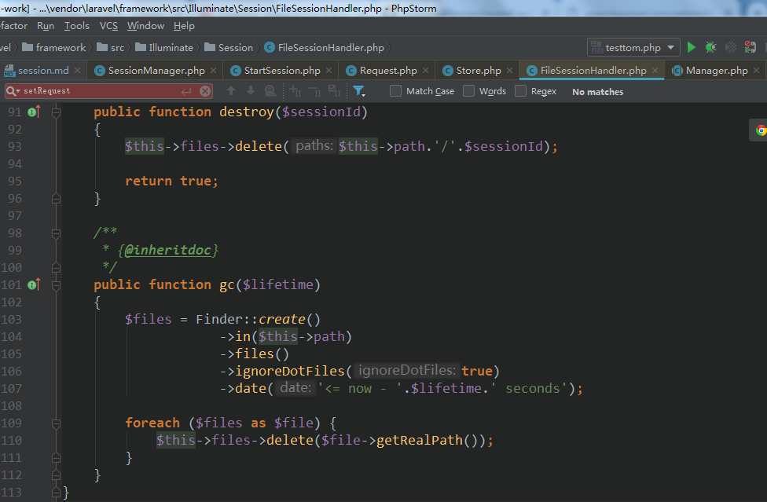  

- response header cookie 设置  
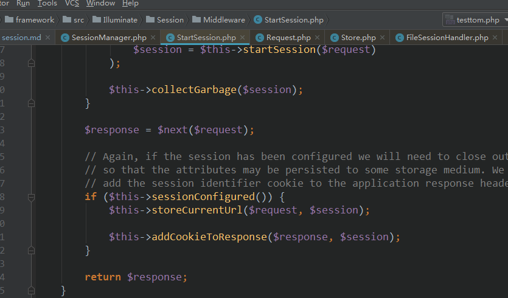  